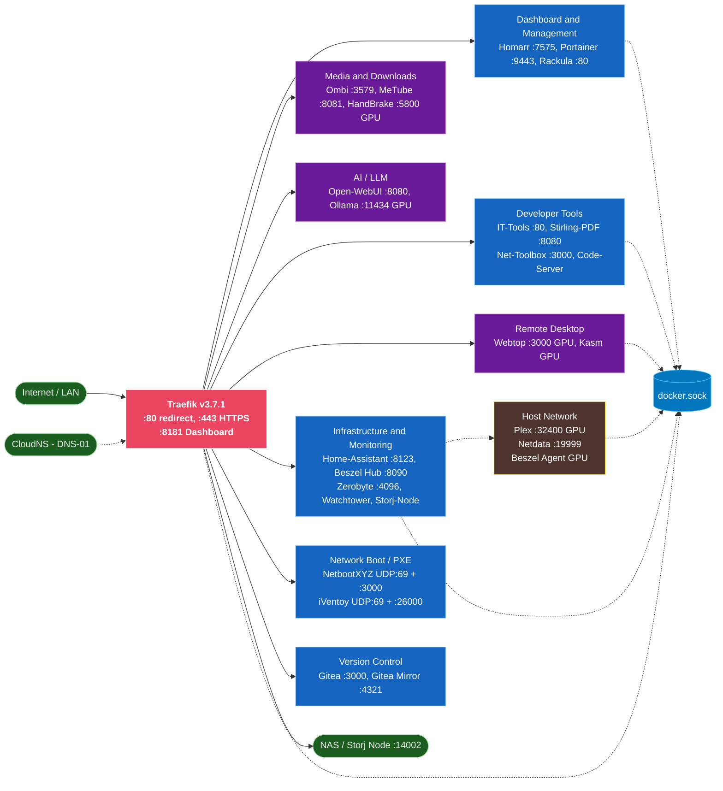

# Homelab GitOps

> Self-hosted services managed as code — Docker Compose stacks, GitOps deployments, and Terraform-provisioned VMs for a resilient homelab.

[](https://github.com/locus313/homelab-gitops/actions/workflows/yaml-lint.yml)
[](LICENSE)

A collection of production-ready Docker Compose configurations for self-hosted services, wired together through a Traefik reverse proxy with automatic TLS, managed as GitOps stacks via Portainer, and backed by Terraform-provisioned VMs on both a ScaleComputing HCI cluster and a Proxmox host.

[Architecture](#architecture) • [Services](#services) • [Getting Started](#getting-started) • [Configuration](#configuration) • [Project Structure](#project-structure) • [Infrastructure](#infrastructure)

---

## Architecture

All services share the `proxynet` external Docker network. Traefik is the single ingress point — no service exposes a host port directly (with a small number of necessary exceptions). SSL certificates are issued automatically via Let's Encrypt with a CloudNS DNS-01 challenge.



> **Color key:** Red = Traefik ingress · Blue = `proxynet` service groups · Purple = GPU-accelerated · Brown/yellow = host-network services

### Standard service pattern

Every service in this repo follows the same Docker Compose structure:

```yaml
services:
  service-name:
    image: vendor/image:1.2.3      # pinned — never 'latest'
    container_name: service-name
    restart: unless-stopped
    networks:
      - proxynet
    volumes:
      - ${DOCKER_BASE_PATH}/service-name:/config
    environment:
      PUID: ${PUID}
      PGID: ${PGID}
      TZ: ${TZ}
    labels:
      - traefik.enable=true
      - traefik.http.services.service-name.loadbalancer.server.port=8080
      - traefik.http.routers.service-name.rule=Host(`service-name.${TRAEFIK_BASE_DOMAIN}`)
      - traefik.http.routers.service-name.entrypoints=websecure
      - traefik.http.routers.service-name.tls=true
      - traefik.http.routers.service-name.tls.certresolver=cloudns

networks:
  proxynet:
    external: true
```

Notable exceptions: **Plex** and **Netdata** use `network_mode: host`; **Code-Server** shares its Tailscale sidecar's network namespace; **iVentoy** exposes raw host ports for PXE/TFTP.

---

## Services

| Category | Service | Description |
|----------|---------|-------------|
| **Ingress** | [Traefik](docker/traefik/) | Reverse proxy, TLS termination, automatic Let's Encrypt |
| **Management** | [Portainer](docker/portainer/) | Container management UI and GitOps stack deployment |
| **Dashboard** | [Homarr](docker/homarr/) | Homelab dashboard with Docker widget integration |
| **Monitoring** | [Beszel](docker/beszel/) | Lightweight server and container monitoring with agent architecture |
| **Monitoring** | [Netdata](docker/netdata/) | Real-time system and container performance metrics |
| **Backup** | [Zerobyte](docker/zerobyte/) | Restic-based backup automation with web UI and multi-protocol support |
| **Media** | [Plex](docker/plex/) | Media server with hardware transcoding (host network) |
| **Media** | [Ombi](docker/ombi/) | Media request management integrated with Plex |
| **Media** | [HandBrake](docker/handbrake/) | Video transcoder with optional GPU acceleration |
| **Media** | [MeTube](docker/metube/) | yt-dlp web interface for video downloading |
| **AI** | [Open-WebUI](docker/open-webui/) | Interface for local LLMs backed by an Ollama sidecar |
| **Dev Tools** | [Code-Server](docker/code-server/) | Browser-based VS Code with Tailscale sidecar |
| **Dev Tools** | [IT Tools](docker/it-tools/) | 100+ developer utility tools, offline-first |
| **Dev Tools** | [Stirling PDF](docker/stirling-pdf/) | PDF manipulation toolkit |
| **Dev Tools** | [Networking Toolbox](docker/networking-toolbox/) | DNS, SSL, subnet, and network diagnostic tools |
| **Remote Desktop** | [Webtop](docker/webtop/) | Full Linux desktop in-browser with GPU acceleration |
| **Remote Desktop** | [Kasm](docker/kasm/) | Container streaming platform for disposable browser desktops |
| **VCS** | [Gitea](docker/gitea/) | Self-hosted Git service with PostgreSQL backend |
| **VCS** | [Gitea Mirror](docker/gitea-mirror/) | Automated GitHub-to-Gitea repository mirroring |
| **Home Automation** | [Home Assistant](docker/home-assistant/) | Local-first home automation with device and energy management |
| **Infrastructure** | [Rackula](docker/rackula/) | Drag-and-drop rack layout designer with PNG/PDF/SVG export |
| **Storage** | [Storj Node](docker/storj-node/) | Decentralized storage node earning STORJ tokens |
| **Network Boot** | [iVentoy](docker/iventoy/) | PXE boot server with a web UI for ISO management |
| **Network Boot** | [NetbootXYZ](docker/netbootxyz/) | Network boot menu with customizable iPXE scripts |
| **Updates** | [Watchtower](docker/watchtower/) | Automated Docker container image updates |

---

## Getting Started

### Prerequisites

- Docker 20.10+ and Docker Compose v2
- A domain name with DNS manageable via [CloudNS](https://cloudns.net) (for Let's Encrypt DNS-01)
- Git

### 1. Create the shared network

All services communicate through the `proxynet` network. Create it once before deploying anything:

```bash
docker network create proxynet
```

> [!IMPORTANT]
> Without this network, every service will fail to start.

### 2. Clone and configure Traefik

Traefik **must be deployed first** — it is the routing and TLS layer every other service depends on.

```bash
git clone https://github.com/your-username/homelab-gitops.git
cd homelab-gitops/docker/traefik
cp .env.example .env
# Edit .env: set TRAEFIK_BASE_DOMAIN, CLOUDNS_SUB_AUTH_ID, CLOUDNS_AUTH_PASSWORD
docker compose up -d
```

Verify Traefik is healthy and can reach the dashboard at `https://traefik.<your-domain>`.

### 3. Deploy other services

Each service follows the same workflow:

```bash
cd docker/<service-name>
cp .env.example .env
# Edit .env with your values
docker compose up -d
```

> [!TIP]
> Use **Portainer stacks** with Git repository integration for a centralized UI and automated redeployment on push. Set the compose path to `docker/<service-name>` for each stack.

---

## Configuration

### Common environment variables

All services use a shared set of core variables:

| Variable | Description | Example |
|----------|-------------|---------|
| `DOCKER_BASE_PATH` | Root path for all service data volumes | `/docker` |
| `PUID` | Host user ID for file ownership | `1000` |
| `PGID` | Host group ID for file ownership | `1000` |
| `TZ` | Timezone — always `America/Los_Angeles` | `America/Los_Angeles` |
| `TRAEFIK_BASE_DOMAIN` | Base domain used in Traefik routing rules | `home.example.com` |

### Service-specific variables

| Service | Key Variables |
|---------|--------------|
| Traefik | `CLOUDNS_SUB_AUTH_ID`, `CLOUDNS_AUTH_PASSWORD` |
| Plex | `PLEX_CLAIM`, `MEDIA_PATH` |
| Homarr | `SECRET_ENCRYPTION_KEY` |
| Beszel | `BESZEL_PUBLIC_KEY` |
| Netdata | `NETDATA_CLAIM_TOKEN`, `NETDATA_CLAIM_ROOMS` |
| HandBrake | `MEDIA_PATH`, `BACKUP_PATH` |
| Code-Server | `PASSWORD`, `TS_AUTHKEY` |
| Gitea | `GITEA_DB_NAME`, `GITEA_DB_USER`, `GITEA_DB_PASSWORD` |
| Gitea Mirror | `BETTER_AUTH_SECRET` |
| Storj Node | `WALLET`, `EMAIL`, `ADDRESS`, `STORAGE`, `STORAGE_PATH` |
| Kasm | `KASM_PORT`, `DOCKER_HUB_USERNAME`, `DOCKER_HUB_PASSWORD` |
| Rackula | `RACKULA_API_WRITE_TOKEN`, `RACKULA_AUTH_MODE`, `RACKULA_AUTH_SESSION_SECRET` |

Each service's `.env.example` file is the authoritative reference for all required and optional variables.

### Adding custom Traefik routes

For non-Docker services or advanced routing, drop a YAML file in `docker/traefik/config/dynamic/`:

```yaml
# docker/traefik/config/dynamic/my-service.yaml
http:
  routers:
    my-service:
      entryPoints: [websecure]
      rule: 'Host(`my-service.{{ env "TRAEFIK_BASE_DOMAIN" }}`)'
      service: my-service-svc
      tls:
        certResolver: cloudns
  services:
    my-service-svc:
      loadBalancer:
        servers:
          - url: 'http://192.168.1.50:8080'
```

---

## Project Structure

```
homelab-gitops/
├── docker/                     # One directory per service
│   ├── traefik/                # Reverse proxy (deploy first)
│   │   ├── config/
│   │   │   ├── traefik.yaml    # Static configuration
│   │   │   └── dynamic/        # Dynamic routing files
│   │   └── docker-compose.yml
│   └── <service>/
│       ├── docker-compose.yml
│       ├── .env.example
│       └── README.md
├── terraform/
│   ├── homelab/                # Main homelab infra (SC cluster + Proxmox)
│   ├── modules/
│   │   ├── cloud-images/       # Ubuntu LTS cloud image references
│   │   ├── proxmox-vm/         # Proxmox VM module
│   │   └── vm/                 # ScaleComputing VM module
│   └── portainer/              # Portainer provisioning
├── docs/
│   └── resilience-planning.md  # Two-node HA design and rationale
├── .github/
│   ├── workflows/              # CI/CD pipelines
│   ├── scripts/                # Automation helpers
│   └── copilot-instructions.md # AI coding guidelines
└── CHANGELOG.md
```

---

## Infrastructure

The homelab runs across two hosts managed by Terraform:

| Host | Role | Notes |
|------|------|-------|
| ScaleComputing cluster | Always-on VM (`sc_docker_vm`) | Ubuntu 26.04 · resilient baseline |
| `pve01` (Intel N150) | Secondary VM (`dh01_docker_vm`) | Proxmox VE · iGPU for Beszel Agent |

Terraform modules live in `terraform/modules/` and cover VM creation with cloud-init, configurable CPU/memory/disk, and per-node password generation. Credentials are passed through environment variables via `.envrc` — never hardcoded.

> See [docs/resilience-planning.md](docs/resilience-planning.md) for the full failover strategy and the rationale for the two-node architecture.

---

## Automation

### Changelog generation

Commit messages pushed to `main` are automatically harvested by `.github/scripts/update-changelog.py` and committed to `CHANGELOG.md`. The workflow skips commits that only touch `CHANGELOG.md` or `.github/dependabot.yml` to avoid loops.

### Dependabot auto-configuration

`.github/scripts/generate-dependabot.sh` scans the repository for every `docker-compose*.yml` file and opens a PR with an updated `.github/dependabot.yml`. Docker Compose updates run daily; GitHub Actions pin updates run weekly (Saturdays).

### YAML validation

Every push or pull request touching `.yml`/`.yaml` files triggers `yamllint` via the `yaml-lint.yml` workflow. Run the same check locally before committing:

```bash
yamllint -c .github/.yamllint .
```

---

## Troubleshooting

| Symptom | Likely cause | Fix |
|---------|-------------|-----|
| Service fails to start | `proxynet` network missing | `docker network create proxynet` |
| Service not reachable via domain | Wrong or missing Traefik labels | Check labels, verify service is on `proxynet` |
| SSL certificate not issued | CloudNS credentials wrong or DNS not delegated | Check Traefik logs for ACME errors |
| File permission errors in container | Wrong `PUID`/`PGID` | Match the host user: `id $(whoami)` |
| Unexpected behaviour after update | `latest` tag pulled a breaking change | Pin images to specific version tags |

**Quick diagnostics:**

```bash
# Service logs
docker logs -f <service-name>

# Confirm service is on proxynet
docker network inspect proxynet | grep <service-name>

# Traefik access log
tail -f ${DOCKER_BASE_PATH}/traefik/logs/traefik.log
```
